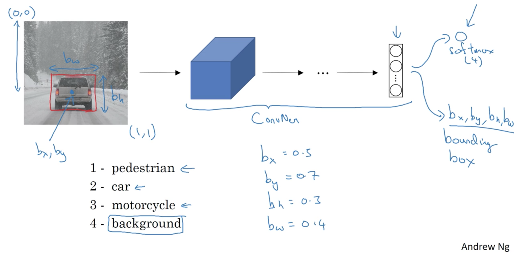
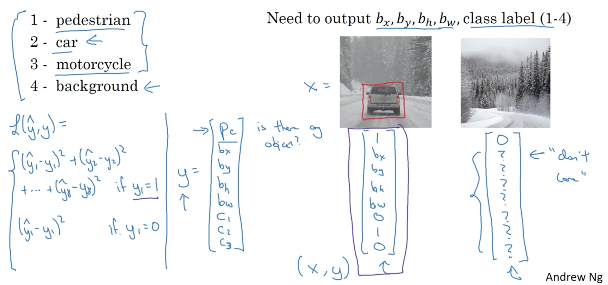
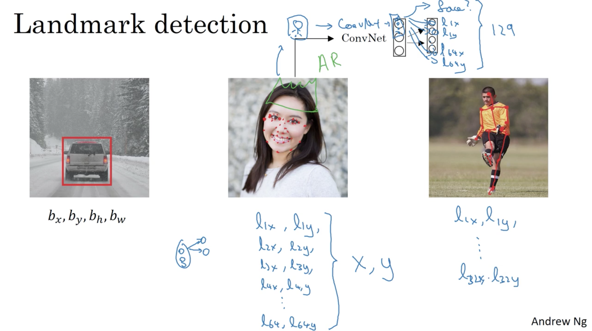
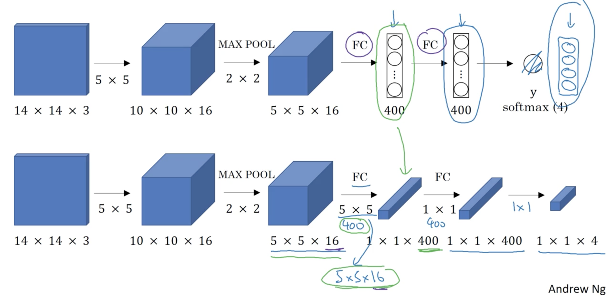

# Object detection

> Week 3 lecture notes

## Object Localization

### Classification with Localization

  

### Defining the target label y

  

Loss function is defined as follows:

$$
\mathcal{L}(\hat{y}, y)= 
\begin{cases}
    (\hat{y}_1 - y_1)^2 + (\hat{y}_2 - y_2)^2 + \cdots + (\hat{y}_n - y_n)^2,& \text{if } y_1 = 1\\
    (\hat{y}_1 - y_1)^2,              & \text{if } y_1 = 0
\end{cases}
$$

## Landmark Detection

  

## Object Detection

### Sliding windows detection

  

> Example of the sliding a window approach, where we slide a window from left-to-right and top-to-bottom.

## Convolutional Implementation of Sliding Windows

### Turning FC layers to Convolutional layers

  

## Bounding Box Predictions

### YOLO Algorithm

> You only look once (YOLO) is a state-of-the-art, real-time object detection system. On a Pascal Titan X it processes images at 30 FPS and has a mAP of 57.9% on COCO test-dev.

YOLO divides the input image into an $S \times S$ grid. Each grid cell predicts only one object. For example, the yellow grid cell below tries to predict the "person" object whose center (the blue dot) falls inside the grid cell.

  

Each grid cell predicts a fixed number of boundary boxes. In this example, the yellow grid cell makes two boundary box predictions (blue boxes) to locate where the person is.

  

## Intersection over Union

## References

[1] Sliding Windows - Department of Computer Science, U of Toronto. [Object Detection - Sliding Windows](http://www.cs.utoronto.ca/~fidler/slides/CSC420/lecture17.pdf)  
[2] Adrian Rosebrock, [Sliding Windows for Object Detection with Python and OpenCV](https://www.pyimagesearch.com/2015/03/23/sliding-windows-for-object-detection-with-python-and-opencv/)