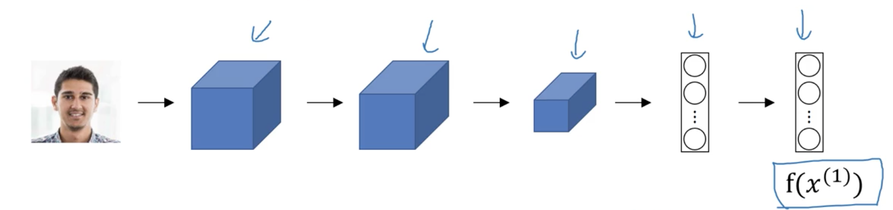
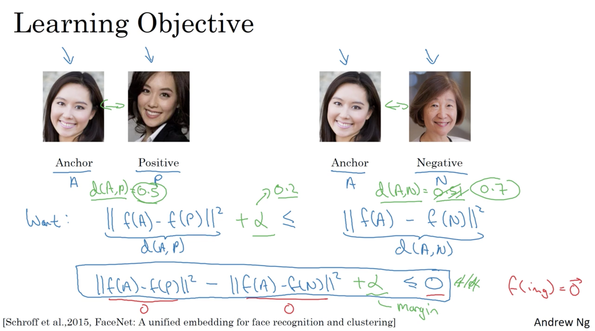
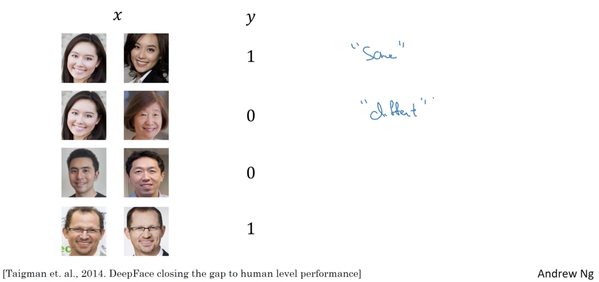

# Special applications: Face recognition & Neural style transfer

> Week 4 lecture notes

## Face verification v.s. Face recognition

**Verfication**

- Input: image, name/ID
- Output: Whether the imput image is that of the claimed person

**Recognition**

- Has a database of `K` persons
- Get an input image
- Output ID if the image is any of the `K` persons (or "not recognized")

## One Shot Learning

Learning a "similarity" function

$d(\text{img1}, \text{img2})$ - degree of difference of two images

if $d(\text{img1}, \text{img2}) \leq \tau$, where $\tau$ is a threshold parameter, then predict these two images are "same"

## Siamese Network

Siamese networks are a special type of neural network architecture. Instead of a model learning to *classify* its inputs, the neural networks learns to *differentiate* between two inputs. **It learns the similarity between them.**

<figure>
    
</figure>

Parameters of NN define an encoding $f(x^{(i)})$

Learn parameters so that:

- If $x^{(i)}, x^{(j)}$ are the same person, $\| f(x^{(i)}) - f(x^{(j)})\|^2$ is small
- If $x^{(i)}, x^{(j)}$ are different person, $\| f(x^{(i)}) - f(x^{(j)})\|^2$ is large

## The architecture

A Siamese networks consists of two identical neural networks, each taking one of the two input images. The last layers of the two networks are then fed to a contrastive loss function , which calculates the similarity between the two images. I have made an illustration to help explain this architecture.

<figure>
    
</figure>

There are two sister networks, which are identical neural networks, with the exact same weights.

Each image in the image pair is fed to one of these networks. The networks are optimised using a contrastive loss function(we will get to the exact function).

## Triplet Loss

### Learning objective

<figure>
    
</figure>

### Loss function

- $p_i$: Input to the $Q$ (Query) network. This image is randomly sampled across any class.
- $p_i^+$: Input to the $P$ (Positive) network. This image is randomly sampled from the **SAME** class as the query image.
- $p_i^-$: Input to the $N$ (Negative) network. This image is randomly sample from any class **EXCEPT** the class of $p_i$.

**triplet loss**. It teaches the network to produce similar feature embeddings for images from the same class (and different embeddings for images from different classes).

$$ l(p_i, p_i^+, p_i^-) = \max \{ 0, g + D \big(f(p_i), f(p_i^+) \big) - D \big( f(p_i), f(p_i^-) \big)  \} $$

$D$ is the Euclidean Distance between $f(p_i)$ and $f(p_i^{+/-})$.

$$ D(p, q) = \sqrt{(q_1 − p_1)^2 + (q_2 − p_2)^2 + \dots + (q_n − p_n)^2} $$

$g$ is the gap parameter that regularizes the gap between the distance of two image pairs: $(p_i, p_i^+)$ and $(p_i, p_i^-)$.

## Face Verification and Binary Classification

<figure>
    
</figure>

## References

[1] Harshvardhan Gupta, [One Shot Learning with Siamese Networks in PyTorch](https://hackernoon.com/one-shot-learning-with-siamese-networks-in-pytorch-8ddaab10340e)

