# Recurrent Neural Networks

> Week 1 lecture notes

## Notation

### Representing words

Vocabulary/Dictionary: make a list of the words used in a sentence.

For example:

x: `Harry Potter and Hermione Granger invented a new spell.`

and the corresponding vocabulary is `[a, aron, and, ... zulu]`. Then "one-hot" encode all the word in vector formation.

What if you encounter a word that is not in your vocabulary? Well the answer is, you create a new token or a new fake word called **Unknown Word** which under note as follows and go back as UNK to represent words not in your vocabulary

## Recurrent Neural Network Model

Why not standard neural network?

- Inputs, outputs can be different lengths in different examples.
- Doesn't share features learned across different positions of text.

### Recurrent Neural Networks

  

### Forward propagation

  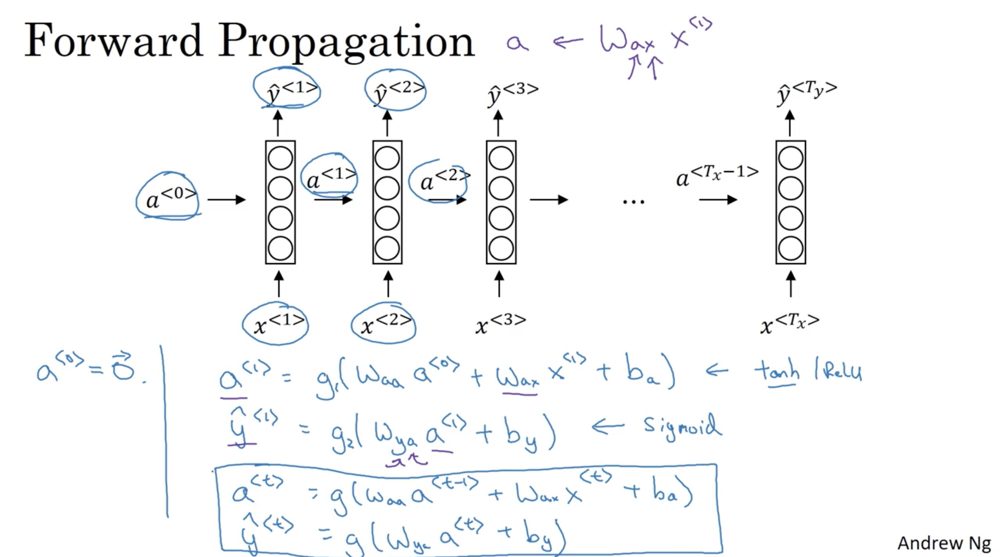

## Backpropagation through time

  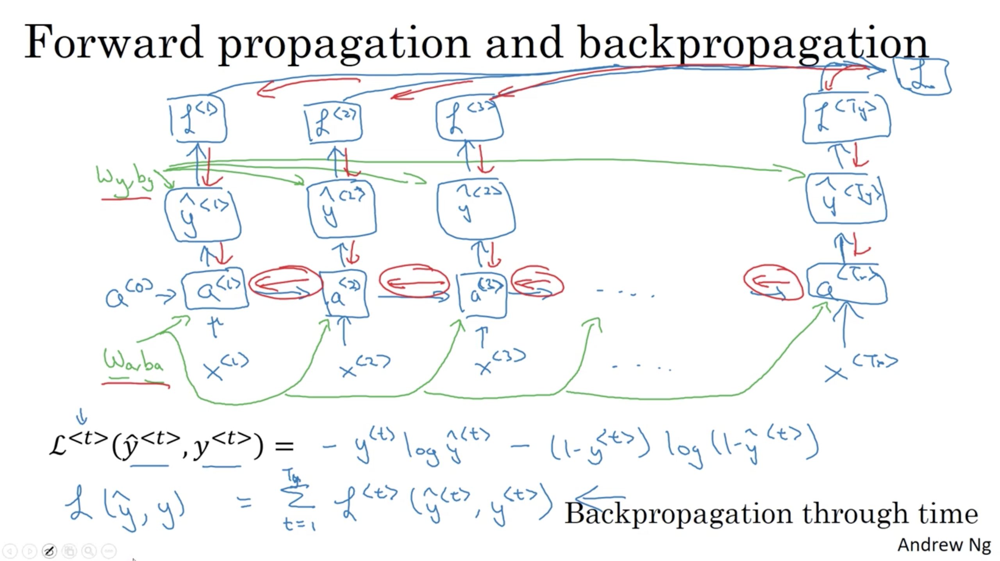

## Different types of RNNs

### Examples of RNN architectures

  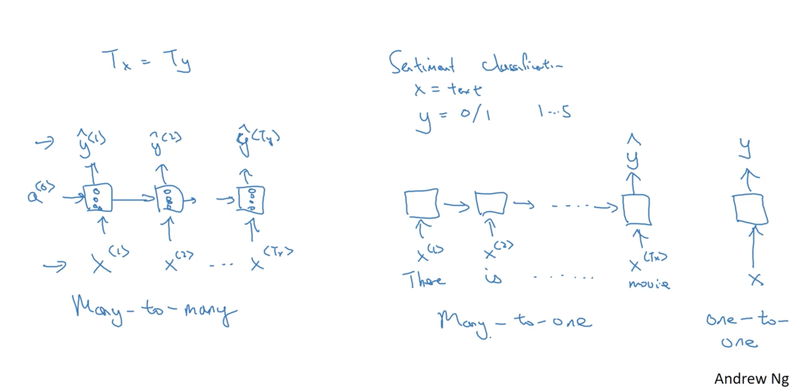

For example,

One-to-many -> Music generation

  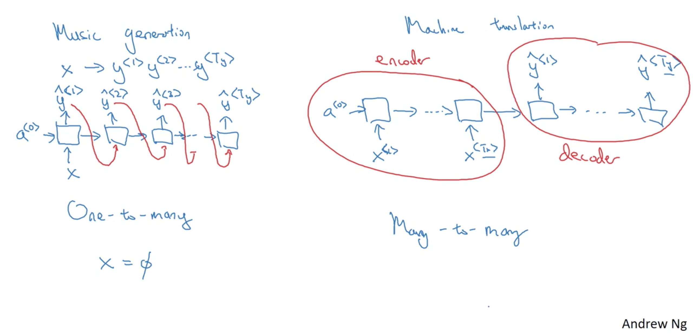

### Summary

  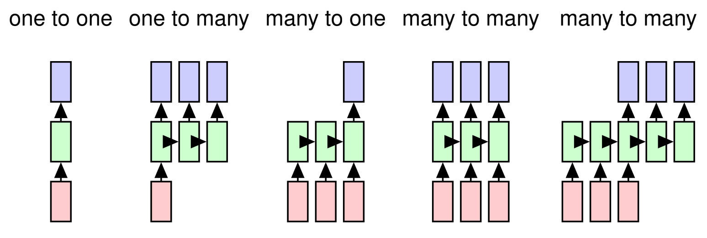

## Language model and sequence generation

  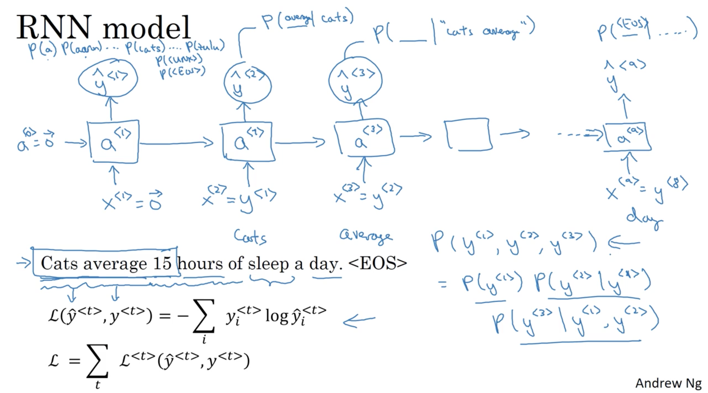

### Character-level language model

  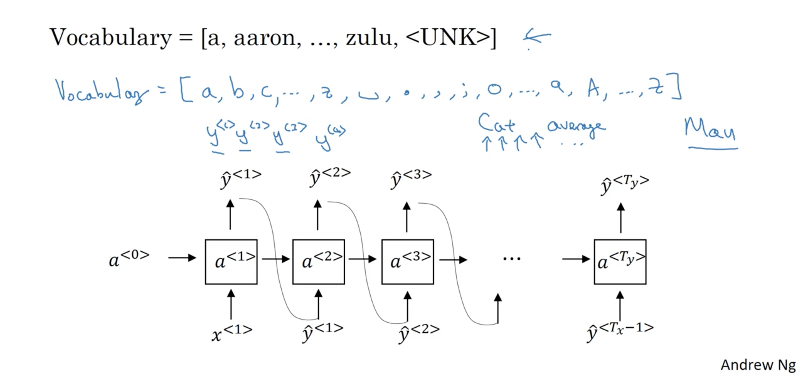

The disadvantage of character-level model is that you end up with a much longer sequence. Character language models are not as good as word level language models at capturing long range dependencies between how the the earlier parts of the sentence also affect the later part of the sentence.

## Vanishing gradients with RNNs

> When we're doing back prop for very deep neural networks, the gradients should not just decrease exponentially, they may also increase exponentially with the number of layers you go through - Exploding Gradients.
> 
> if you do see exploding gradients, one solution to that is apply gradient clipping. And what that really means, all that means is look at your gradient vectors, and if it is bigger than some threshold, re-scale some of your gradient vector so that is not too big. 

### How to solve the vanishing gradients problem?

  

## Gated Recurrent Unit (GRU)

For GRU, the hidden state $h_t$ is computed as

$$
\begin{aligned}
    z_{t} & =\sigma\big(x_{t}U^{z}+h_{t-1}W^{z}\big)\newline
    r_{t} & =\sigma\big(x_{t}U^{r}+h_{t-1}W^{r}\big)\newline
    \tilde{h}_{t} & =\tanh\big(x_{t}U^{h}+(r_{t}\ast h_{t-1})W^{h}\big)\newline
    h_{t} & =(1-z_{t})\ast h_{t-1}+z_{t}\ast\tilde{h}_{t}
\end{aligned}
$$

Here $r$ is a reset gate, and $z$ is an update gate. Intuitively, the reset gate determines how to combine the new input with the previous memory, and the update gate defines how much of the previous memory to keep around. If set the reset to all $1$'s and update gate to all $0$'s, it will arrive at the vanilla RNN model.

- A GRU has two gates, an LSTM has three gates.
- GRUs don't possess and internal memory ($c_t$) that is different from the exposed hidden state. They don't have the output gate that is present in LSTMs.
- The input and forget gates are coupled by an update gate $z$ and the reset gate $r$ is applied directly to the previous hidden state. Thus, the responsibility of the reset gate in a LSTM is really split up into both $r$ and $z$.
- We don't apply a second nonlinearity when computing the output.

  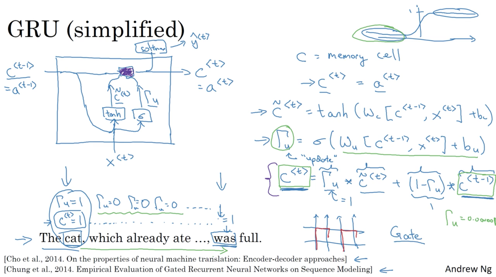

## Long Short Term Memory (LSTM)

> Strongly recommend read [Understanding LSTM Networks](http://colah.github.io/posts/2015-08-Understanding-LSTMs/) by Christopher Olah to fully understand LSTM.

  

$$
\begin{aligned}
    i_{t} & =\sigma\big(x_{t}U^{i}+h_{t-1}W^{i}\big)\newline
    f_{t} & =\sigma\big(x_{t}U^{f}+h_{t-1}W^{f}\big)\newline
    o_{t} & =\sigma\big(x_{t}U^{o}+h_{t-1}W^{o}\big)\newline
    \tilde{C}_{t} & =\tanh\big(x_{t}U^{g}+h_{t-1}W^{g}\big)\newline
    C_{t} & =\sigma\big(f_{t}\ast C_{t-1}+i_{t}\ast\tilde{C}_{t}\big)\newline
    h_{t} & =\tanh(C_{t})\ast o_{t}
\end{aligned}
$$

  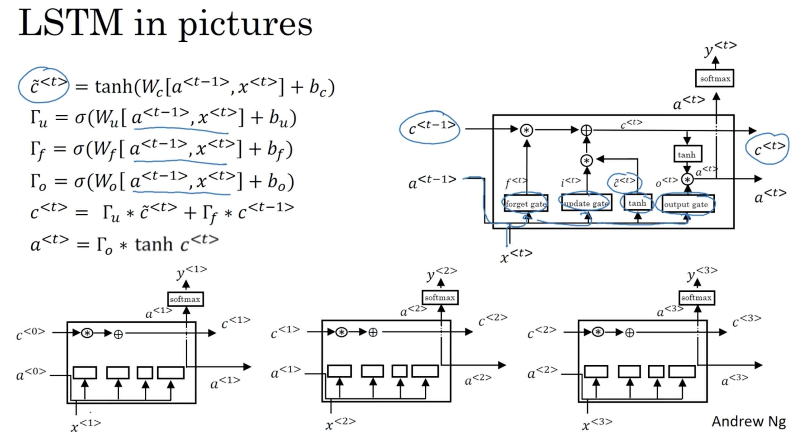

## GRU and LSTM

  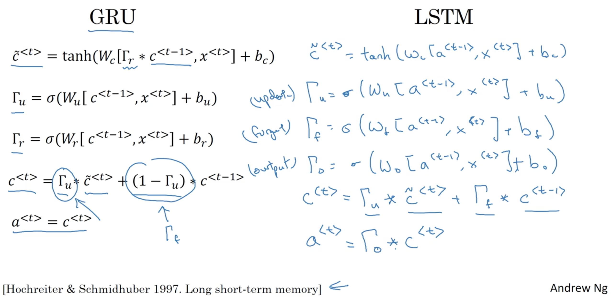

## Bidirectional RNN

  

General Structure of Bidirectional Recurrent Neural Networks. [Image Source: colah's blog](http://colah.github.io/posts/2015-09-NN-Types-FP/)

A major issue with all of the above networks is that they learn representations from previous time steps. Sometimes, you might have to learn representations from future time steps to better understand the context and eliminate ambiguity. Take the following examples, “He said, Teddy bears are on sale” and “He said, Teddy Roosevelt was a great President”. In the above two sentences, when we are looking at the word “Teddy” and the previous two words “He said”, we might not be able to understand if the sentence refers to the President or Teddy bears. Therefore, to resolve this ambiguity, we need to look ahead. This is what Bidirectional RNNs accomplish.

The repeating module in a Bidirectional RNN could be a conventional RNN, LSTM or GRU. The structure and the connections of a bidirectional RNN are represented in figure 9. There are two type of connections, one going forward in time, which helps us learn from previous representations and another going backwards in time, which helps us learn from future representations.

**Forward propagation** is done in two steps:

- We move from left to right, starting with the initial time step we compute the values until we reach the final time step
- We move from right to left, starting with the final time step we compute the values until we reach the initial time step

## Deep RNNs

  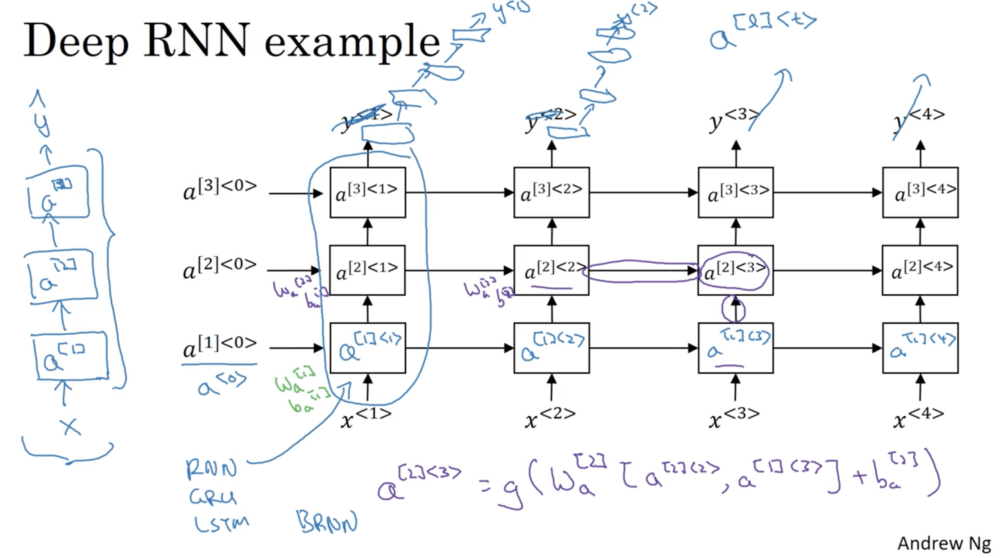

## References

[1] Christopher Olah, [Understanding LSTM Networks](http://colah.github.io/posts/2015-08-Understanding-LSTMs/)  
[2] Denny Britz, [Recurrent Neural Network Tutorial, Part 4 – Implementing a GRU/LSTM RNN with Python and Theano](http://www.wildml.com/2015/10/recurrent-neural-network-tutorial-part-4-implementing-a-grulstm-rnn-with-python-and-theano/)  
[3] Rohith Gandhi, [Introduction to Sequence Models — RNN, Bidirectional RNN, LSTM, GRU](https://towardsdatascience.com/introduction-to-sequence-models-rnn-bidirectional-rnn-lstm-gru-73927ec9df15)  
[4] Ceshine Lee, [Understanding Bidirectional RNN in PyTorch](https://towardsdatascience.com/understanding-bidirectional-rnn-in-pytorch-5bd25a5dd66)  
[5] Alexander Schwing, Matus Telgarsky. "CS446 Machine Learning - Auto-regressive methods lecture slides"