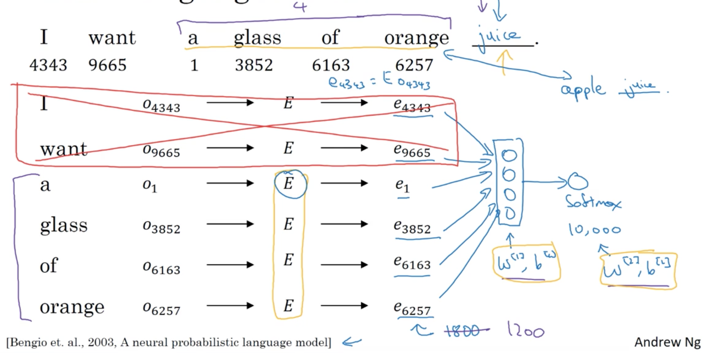

# Natural Language Processing & Word Embeddings

> Week 2 lecture notes

## Introduction to Word Embeddings

### Word Representation

  

### Using word embeddings

#### Transfer learning and word embeddings

- Learn word embeddings from large text corpus. (1-100B words)
- Transfer embedding to new task with smaller training set (maybe 100k words)
- Continue to fine-tunethe word embeddings th new data (Optional)

#### Relation to face encoding

  

### Properties of word embeddings

#### Cosine similarity

  

### Embedding matrix

  

Image Source: [*"Embeddings: A Matrix of Meaning"*](https://medium.com/@Petuum/embeddings-a-matrix-of-meaning-4de877c9aa27)

  

> Initialize $E$ randomly and you're straight in the sense to learn all the parameters of this 300 by 10,000 dimensional matrix and $E$ times this one-hot vector gives you the embedding vector. 

## Learning Word Embeddings: Word2vec & GloVe

### Learning word embeddings

#### Neural Language Model

  

#### Other context/target pairs

  

### Word2Vec

#### Model

  

The primary problem of this model is **computational speed**, solutions to this porblem can be

- hierarchical softmax, e.g. [Hierarchical Softmax](http://ruder.io/word-embeddings-softmax/index.html#hierarchicalsoftmax)

**How do we sample $c$ (context)?**

> One thing you could do is **just sample uniformly, at random, from your training corpus**. When we do that, you find that there are some words that appear extremely frequently. And so, if you do that, you find that in your context to target mapping pairs just get these these types of words extremely frequently, whereas there are other words like orange, apple, and also durian that don't appear that often.

### Negative Sampling

  

$k$ negative examples.

It is suggest to choose $k$ to be $5 \sim 20$ if your dataset is small and maybe $2 \sim 5$ if the dataset is larger

### GloVe word vectors

$X_{ij}$ is the # of times word $i$ ($t$) appear in context $j$ ($c$).

The goal of GloVe model is to minimize

$$
\sum \limits_{i=1}^{N} \sum \limits_{j=1}^{N} f(X_{ij}) (\theta_{i}^{T} e_{j} + b_{i} + b_{j}' - \log (X_{ij}))^2
$$

where

- $N$ stands for # of words in the corpus which equals $10,000$ in the course video
- $i$ stands for $t$ which is target, $\theta_{t}^{T}$
- $j$ stands for $c$ which is context $e_{c}$
- $f(X_{ij})$ is a weighting term, $f(X_{ij}) = 0$ if $X_{ij} = 0$

$\theta_{i}$ and $e_j$ are symmetric and **should be initialized randomly at the beginning of training**

## References

[1] Adam Schwab from Petuum, Inc., [*"Embeddings: A Matrix of Meaning"*](https://medium.com/@Petuum/embeddings-a-matrix-of-meaning-4de877c9aa27)  
[2] Sebastian Ruder, [Part 2: Approximating the Softmax On word embeddings - Hierarchical Softmax](http://ruder.io/word-embeddings-softmax/index.html#hierarchicalsoftmax)