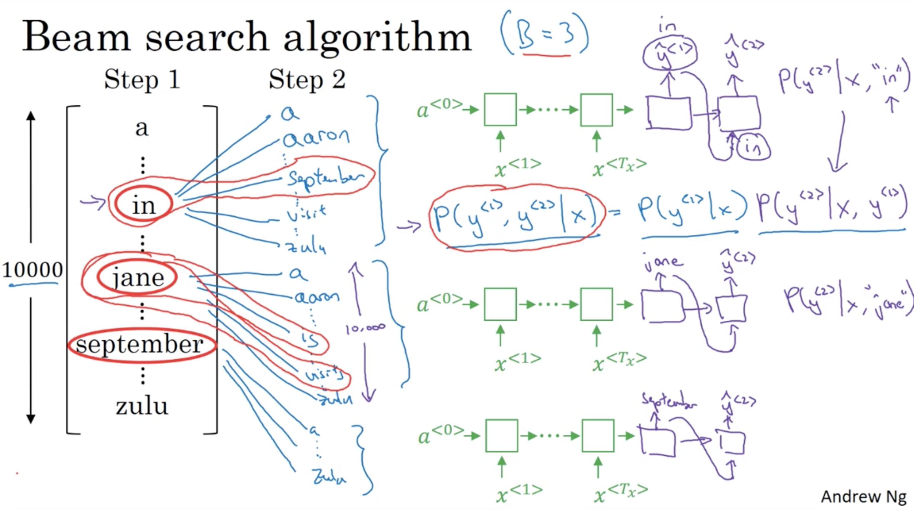
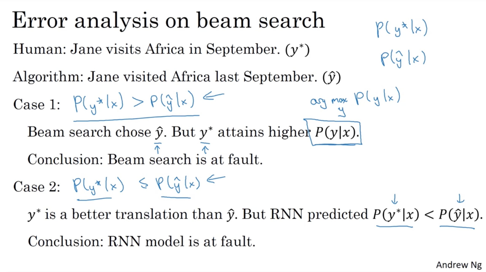

# Sequence models & Attention mechanism

> Week 3 lecture notes

## Various sequence to sequence architectures

### Sequence to Sequence model

  

  

### Image Captioning

  

> A convolutional neural network can be used to create a dense feature vector. This dense vector, also called an embedding, can be used as feature input into other algorithms or networks.
>
> For an image caption model, this embedding becomes a dense representation of the image and will be used as the initial state of the LSTM.

### Beam Search

  

### Refinements to Beam Search

**Length normalization** is a small change to the beam search algorithm that can help you get much better results.

Beam search is maximizing this probability:

$$
\arg \max \limits_{y} \prod \limits_{t=1}^{T_y} P(y^{<t>} | x, y^{<1>}, \cdots, y^{<t-1>})
$$

### Error analysis in beam search

  

## References

[1] Manish Chablani, [Sequence to sequence model: Introduction and concepts](https://towardsdatascience.com/sequence-to-sequence-model-introduction-and-concepts-44d9b41cd42d)  
[2] Cole Murray, [Building an image caption generator with Deep Learning in Tensorflow](https://medium.freecodecamp.org/building-an-image-caption-generator-with-deep-learning-in-tensorflow-a142722e9b1f)  
[3] Prakhar Mishra, [Beam Search — A Search Strategy](https://hackernoon.com/beam-search-a-search-strategy-5d92fb7817f)